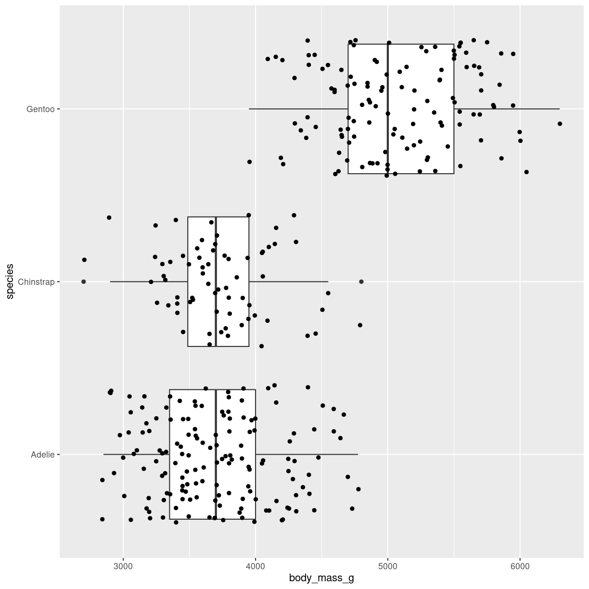
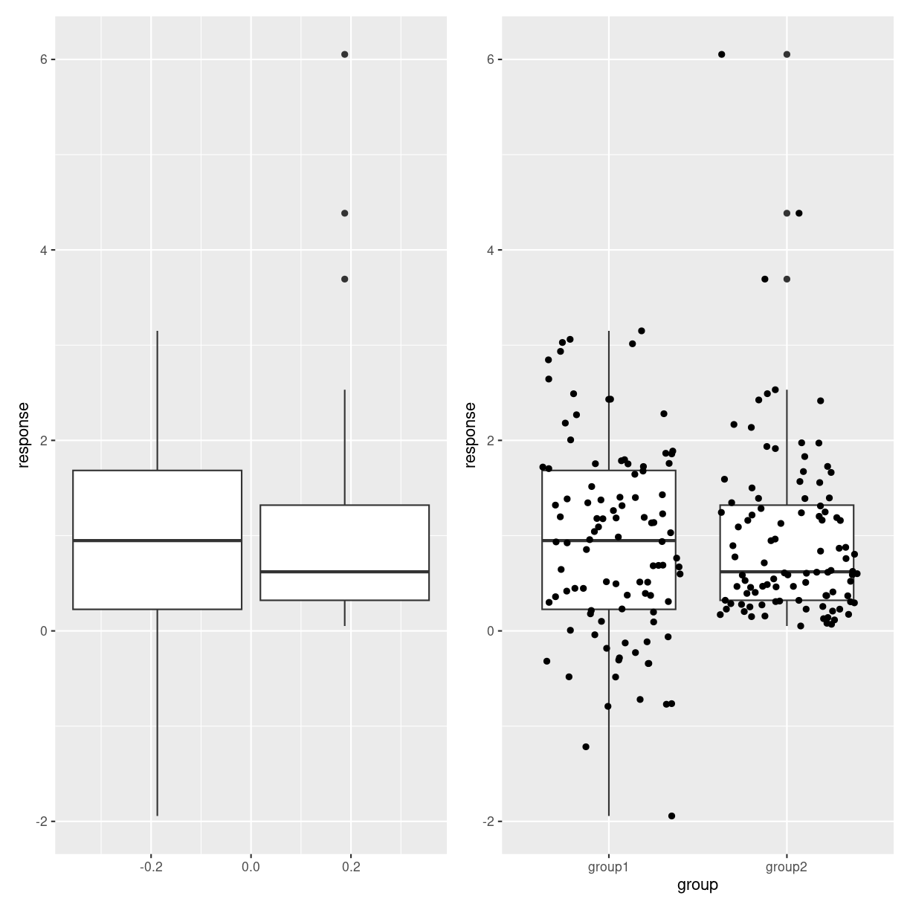
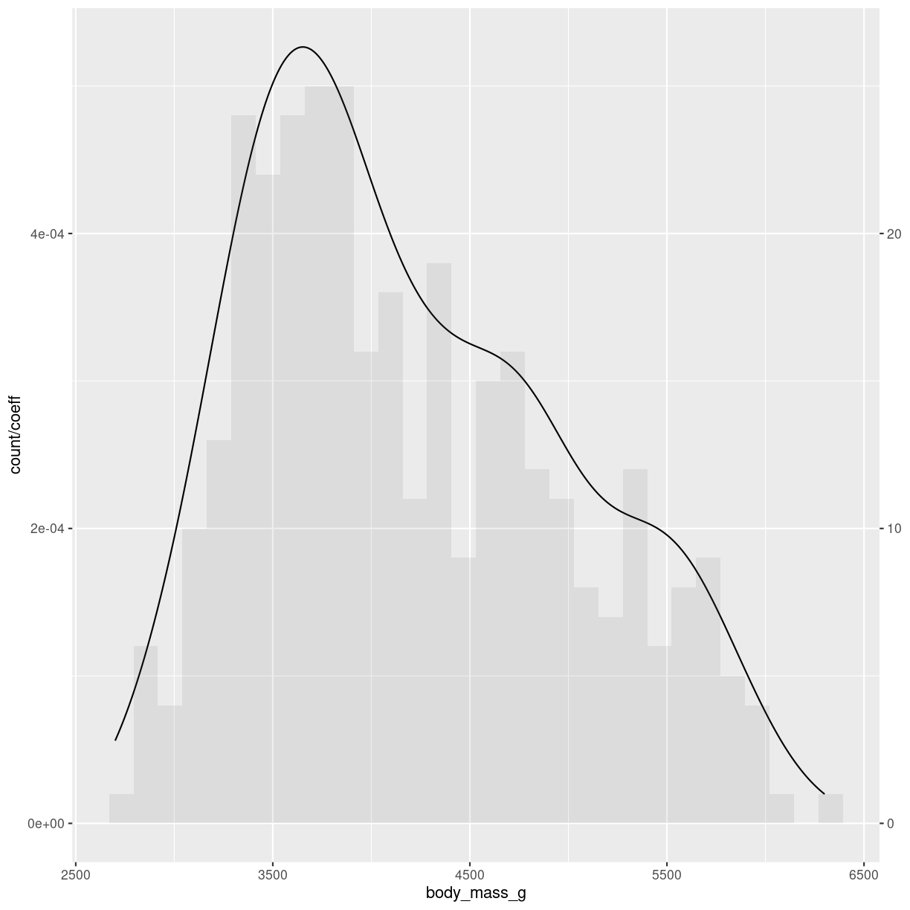
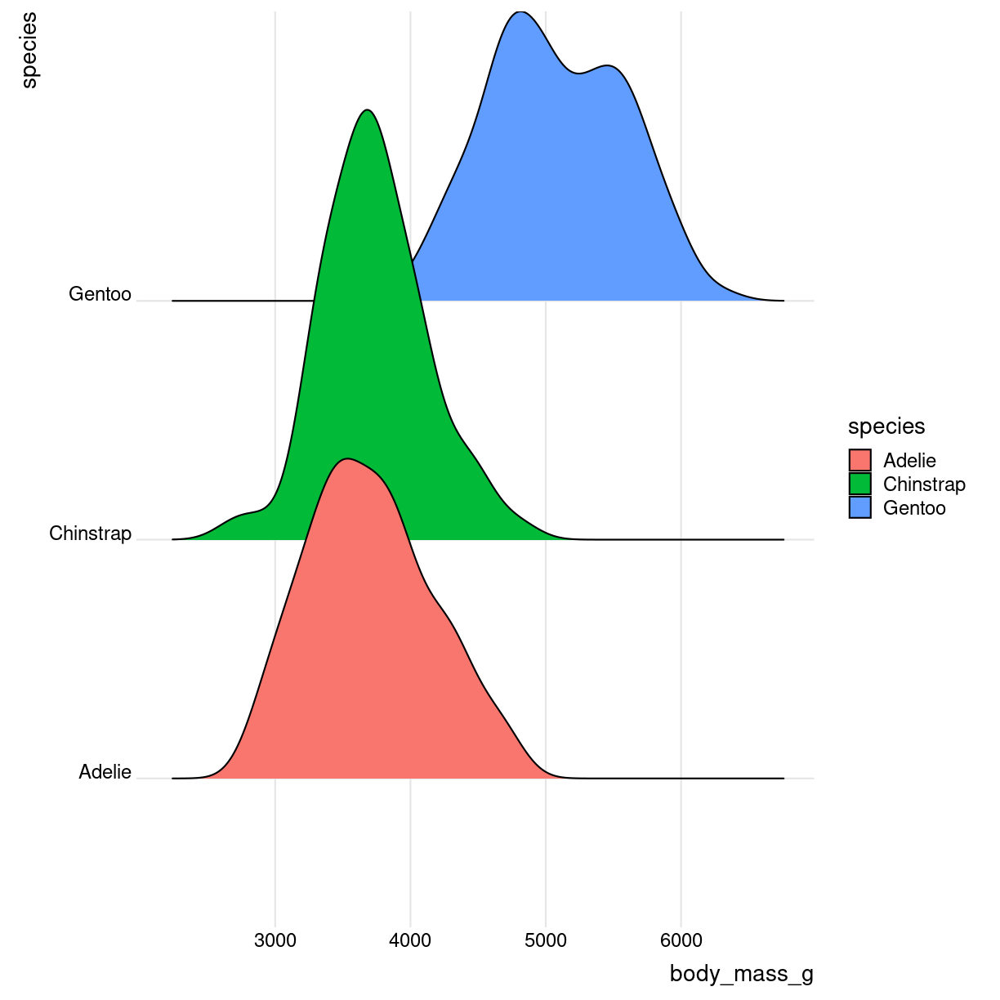

---
# Please do not edit this file directly; it is auto generated.
# Instead, please edit 02-distribution.md in _episodes_rmd/
title: "Distributions"
teaching: 0
exercises: 0
questions: 
- "What are histograms?"
- "What are violin plots?"
- "What are density plots?"
- "What are boxplots?"

objectives:
- "FIXME"

keypoints:
- "FIXME"
source: Rmd
---

We have some data on the mass of penguins. We expect some penguins to weigh 
more than others. Perhaps it is a smaller kind of penguin. Perhaps it is a 
female penguin, and they are smaller than male penguins. And maybe some penguins
are fatter than other penguins.

Ranking penguins from light to heavy, 
how many are there at each weight, or, what is the distribution of their weight?

The plots in this section are useful for visualizing distributions of data.

## Histograms

### What are they?

Histograms takes all the weights of the penguins, divides them into intervals, 
or bins, of weight, eg one bin with 3300 to 3400 grams, and the next bin from 
3400 to 3500 grams. Then we count how many penguins are in a specific bin. 
And plot it. It might look like this:

### What do we use them for?

We typically use histograms to visualise the distribution of a variable. Is it
normal, bimodal, uniform or skewed? It can quickly reveal mistakes in data or 
weird outliers.

We can also use histograms to compare different variables. But beware of comparing
too many, it can make the graphs difficult to read, and the aim of visualising 
is to make things easier to understand.

### How do we make them?

The geom_ we are using here is geom_histogram(). It takes only one variable 
in the mapping.

~~~
ggplot(penguins, aes(x=body_mass_g)) + 
  geom_histogram()
~~~
{: .language-r}

~~~
`stat_bin()` using `bins = 30`. Pick better value with `binwidth`.
~~~
{: .output}

Built into the geom_histogram is the statistical transformation, that counts the 
number of observations in each bin.

Note the message that this statistical transformation as default uses bins = 30.
This is the default number of bins. And it is almost guaranteed that it is not
the best number of bins.

Bins can be determined in two ways, either by providing a number of bins:

`geom_histogram(bins = 30)`

or by specifying the width of the bins:

`geom_histogram(binwidth = 500)`

### Interesting variations

#### More than one distribution on same axis

We can plot more than one distribution in the same plot.

The addition of `alpha = 0.6` makes the bars transparent. 

~~~
penguins %>%
  filter(!is.na(sex)) %>% 
  ggplot( aes(x=body_mass_g, fill=sex)) +
  geom_histogram(alpha = 0.6)
~~~
{: .language-r}

We do not map sex to color, but rather to fill. 
Color is the color of the outline of the individual bars, fill the inside of the 
bars.

#### Upside-down

Or mirrored histogram. One distribution above the x-axis, one below.

The code gets a bit more readable  if we construct two different dataframes, one
for each sex. 
The statistical transformation that counts the 
observations in each bin was build into geom_histogram. We now need to 
plot the negative count for one of the dataframes. Therefore we have
to specify the statistical transformation, in order to place a minus sign in front
of it in the second line. 

Two individual dataframes are plotted, and we have to specify color, since there
is no grouping variabel that can be mapped to the  `fill` argument:

~~~
male <- penguins %>% 
  filter(sex == "male")
female <- penguins %>% 
  filter(sex == "female")
ggplot() +
  geom_histogram(aes(x = female$body_mass_g), fill="#69b3a2" ) +
  geom_histogram(aes(x = male$body_mass_g, y = -..count.. ), fill= "#404080")
~~~
{: .language-r}

~~~
Warning: The dot-dot notation (`..count..`) was deprecated in ggplot2 3.4.0.
ℹ Please use `after_stat(count)` instead.
~~~
{: .warning}

#### Grid
Trying to plot more than two, max three distributions in the same histogram is
bad pratice because it becomes difficult to visually separate the different 
distributions
A good workaround is to plot  `small multiples`. 

We use facetwrap:

~~~
penguins %>% 
  filter(!is.na(sex)) %>% 
  ggplot(aes(body_mass_g)) +
  geom_histogram() +
  facet_wrap(vars(species), nrow = 2)
~~~
{: .language-r}

Rather than specifying the variable used to split the data using `vars(species)`,
it can be specified using the formula notation `~species`. 

nrows and ncols specify the number of rows and columns respectively the the 
grid.

We can facet wrap on more that one variable:

~~~
penguins %>% 
  filter(!is.na(sex)) %>% 
  ggplot(aes(body_mass_g)) +
  geom_histogram() +
  facet_wrap(vars(sex, species))
~~~
{: .language-r}

It is also possible to place the six plots in a grid. In that case we use the
`facet_grid()` function: 

~~~
penguins %>% 
  filter(!is.na(sex)) %>% 
  ggplot(aes(body_mass_g)) +
  geom_histogram() +
  facet_grid(rows = vars(sex), cols= vars(species))
~~~
{: .language-r}

This provides a more consistent presentation of the two facets.

Facetting on more than two variable can get confusing, but can be done.

### Think about

The number of bins (or their width, these two are equivalent) can lead to very
different conclusions. Try several sizes.

* Weird and complicated color schemes does not add insight. Avoid them.
* This is not a barplot! Histograms plot the distribution of a single variable.
* Avoid comparing more than two, maybe three groups in the same histogram. 
* Do not use unequal bin widths. 

## Boxplots

### What are they?

A summary of one numeric variable. It has several elements.

* The line dividing the box represents the median of the data.
* The ends of the box represents the upper and lower quartiles, (Q3 and Q1 
respectively). 50% of the observations are in this box. This is also called the 
interquartile range (IQR).
* The line at the top of the box, shows Q3 + 1.5 * IQR. This is interpreted as the
values above Q3 that are not outliers.
* The line at the bottom of the box, shows Q1 + 1.5 * IQR. This is interpreted as
the values below Q1 that are not outliers.
* Dots at each end of the lines shows potential outliers.

### What do we use them for?

A boxplot summarises several important numbers related to the distribution of 
data. A rule of thumb (but not necessarily a good one), is that if two sets of 
data do not have overlapping boxes, they come for different distributions, and
are therefore different.
Typically we show more than one boxplot, but a collection of boxplots.

### how do we make them?

~~~
penguins %>% 
  ggplot(aes(x = body_mass_g)) + 
  geom_boxplot()
~~~
{: .language-r}

Typically we want to compare the weight of different groups of penguins. That
is, compare the distribution of something, between different groups:

~~~
penguins %>% 
  ggplot(aes(y = species, x = body_mass_g)) + 
  geom_boxplot()
~~~
{: .language-r}

### Interesting variations

#### Boxplot with datapoints
geom_jitter adds small amounts of noise to the points. Points can also be 
added using geom_point()

~~~
penguins %>% 
  ggplot(aes(y = species, x = body_mass_g)) + 
  geom_boxplot() +
  geom_jitter()
~~~
{: .language-r}

#### Notches and coloring outliers

~~~
penguins %>% 
  ggplot(aes(y = species, x = body_mass_g)) + 
  geom_boxplot(
    notch = T,
    notchwidth = 0.5,
    outlier.color = "red"
  )
~~~
{: .language-r}

Outlier shape, fill, size, alpha and stroke can be controlled in similar ways.

#### Variable width of boxes

varwidth = T will adjust the width of the boxes proportional to the squareroot of
the number of observations in the groups.

~~~
penguins %>% 
  ggplot(aes(y = species, x = body_mass_g)) + 
  geom_boxplot(
   varwidth = T
  )
~~~
{: .language-r}

### Think about

Boxplots might hide features of the data. The two plots below show first two 
boxplots that are made from different distributions. The overlap might lead
us to think they are similar. The plot on the right adds the individual datapoints
revealing that the data is not that similar.

## Density plots

### What are they?
A plot of the kernel density estimation of the distribution. 

Think of it as a smoothed histogram.

~~~
`stat_bin()` using `bins = 30`. Pick better value with `binwidth`.
~~~
{: .output}

### What do we use them for?
Density plots show the distribution of a numeric variabel. It gets a bit closer
to an actual continuous distribution than a histogram.

### How do we make them?

As with histograms we only use one variable:

~~~
penguins %>% 
  ggplot(aes(body_mass_g)) + 
  geom_density() 
~~~
{: .language-r}

### Interesting variations

#### More than one distribution on same axis

#### Upside-down

Made in almost the same way as the mirrored histogram:

~~~
male <- penguins %>% 
  filter(sex == "male")
female <- penguins %>% 
  filter(sex == "female")
ggplot() +
  geom_density(aes(x = female$body_mass_g), fill="#69b3a2" ) +
  geom_density(aes(x = male$body_mass_g, y = -..density.. ), fill= "#404080")
~~~
{: .language-r}

#### Grid
  
Fuldstændigt parallelt til grids i histogrammer

### Think about

## Ridgeline

~~~
library(ggridges)
~~~
{: .language-r}

### What are they?
Det kan se ret cool ud. Det er grundlæggende "bare" et sæt af flere 
densityplots.

Også kendt som joyplots

Ren

~~~
Loading required package: viridisLite
~~~
{: .output}

~~~
Picking joint bandwidth of 153
~~~
{: .output}

~~~
Warning: Removed 2 rows containing non-finite values (`stat_density_ridges()`).
~~~
{: .warning}

### What do we use them for?

### how do we make them?

~~~
library(ggridges)

penguins %>% 
  ggplot(aes(x = body_mass_g, y = species, fill = species)) +
  geom_density_ridges()  +
    theme_ridges() 
~~~
{: .language-r}

~~~
Picking joint bandwidth of 153
~~~
{: .output}

~~~
Warning: Removed 2 rows containing non-finite values (`stat_density_ridges()`).
~~~
{: .warning}

### Interesting variations

Og med farvelægning efter vægt

~~~
library(ggridges)
library(viridis)
penguins %>% 
  mutate(body_mass_g = as.numeric(body_mass_g)) %>% 
  ggplot(aes(x = body_mass_g, y = species, fill = ..x..)) +
  geom_density_ridges_gradient()  +
    theme_ridges() 
~~~
{: .language-r}

~~~
Picking joint bandwidth of 153
~~~
{: .output}

### Think about

## Violin

### What are they?

en slags boxplot. formen repræsenterer density. På mange måder bedre
end boxplots. Men stiller lidt større krav til folk der har vænnet sig til at 
læse boxplots.

~~~
penguins %>% 
  ggplot(aes(body_mass_g, y = species, fill = species)) +
  geom_violin() +
  coord_flip()
~~~
{: .language-r}

### What do we use them for?

Tillader os både at se en ranking af forskellige grupper - og deres 
fordelinger. 

### how do we make them?

geom_violin()

### Interesting variations

### Think about

Pas på med at bruge dem hvis datasæt er for små. Da vil et boxplot med
jitter ofte være bedre.

sorter/order grupperne efter median-værdien.

Hvis der er meget forskellige samplesizes, så vis det (se også små 
datasæt)


