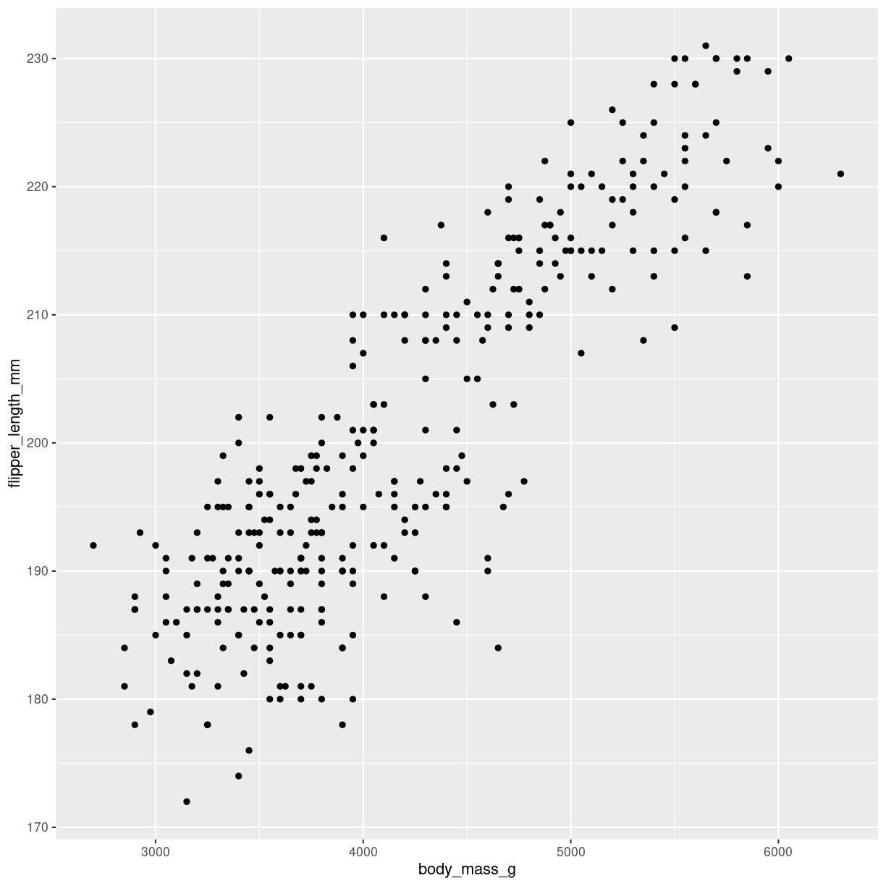
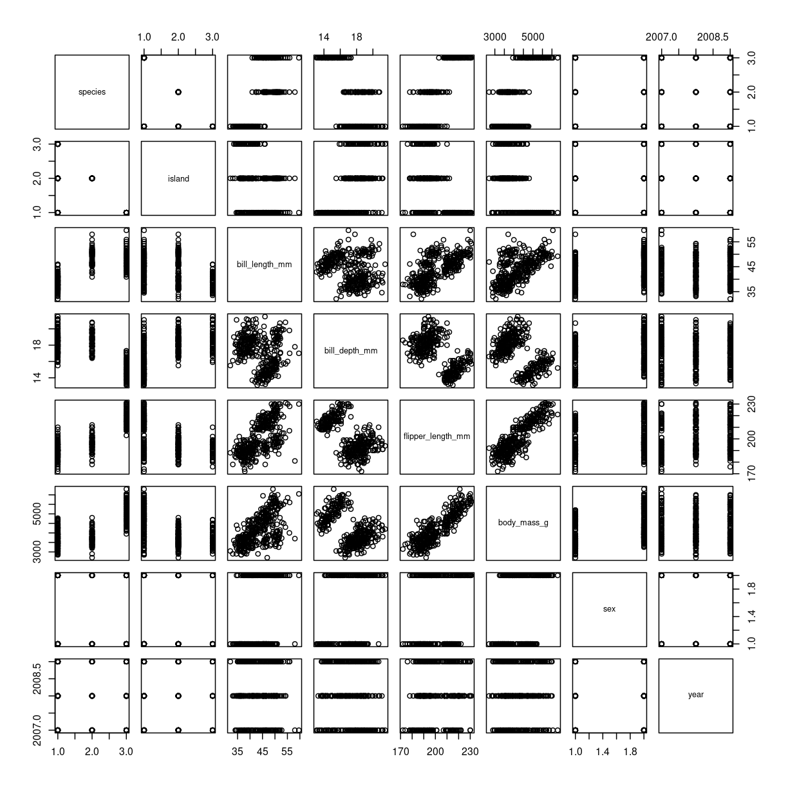
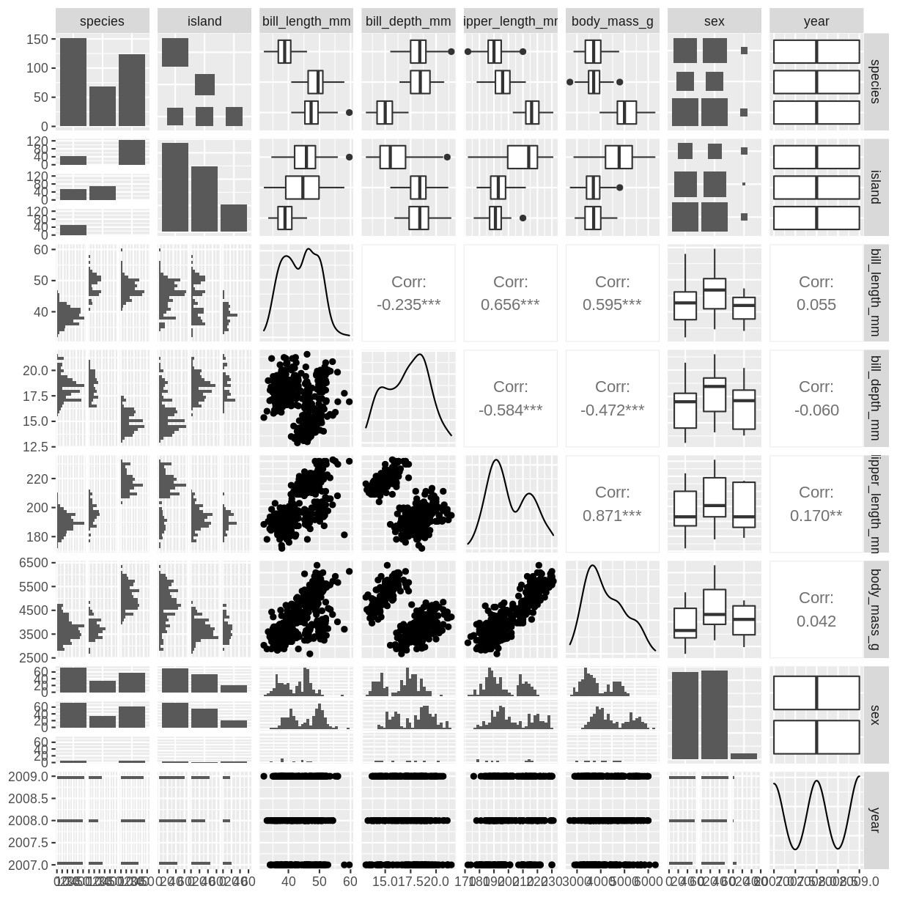
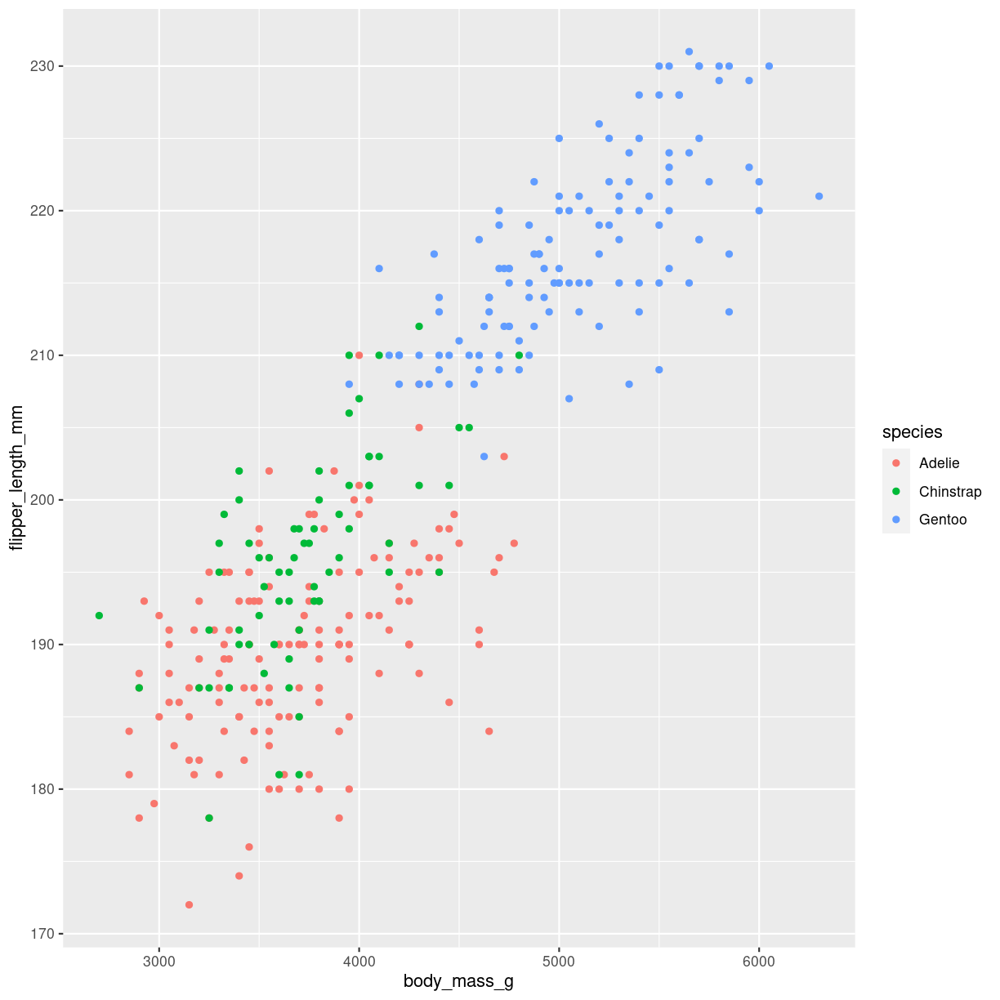
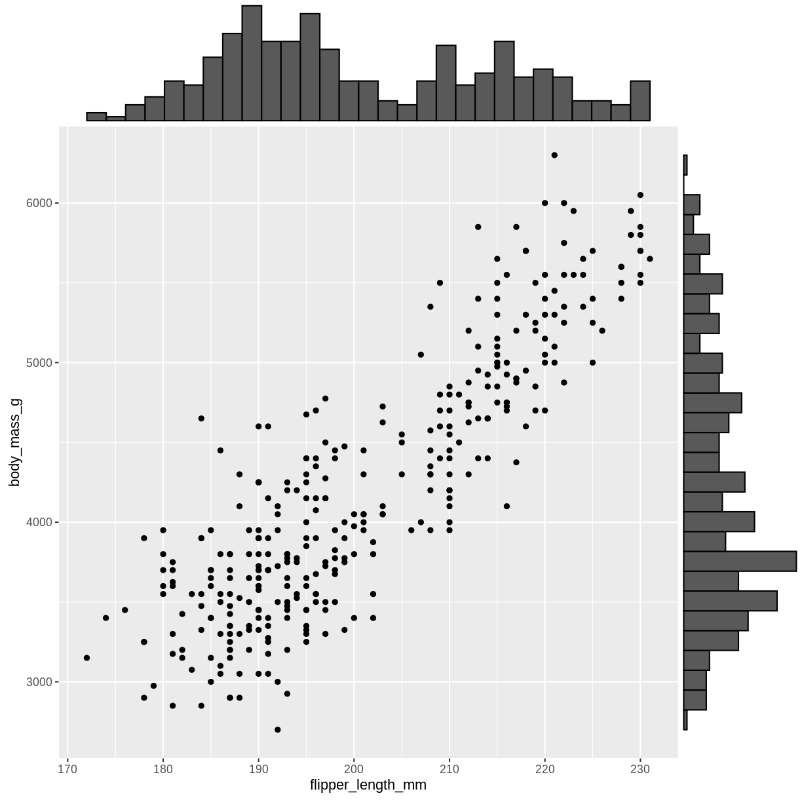
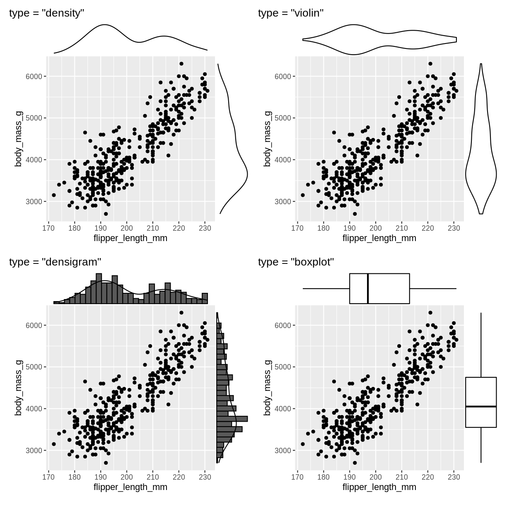

---
# Please do not edit this file directly; it is auto generated.
# Instead, please edit 03-correlations.md in _episodes_rmd/
title: "Correlations"
teaching: 42
exercises: 47
questions: 
- "FIXME"

objectives:
- "FIXME"

keypoints:
- "FIXME"
source: Rmd
---

# Correlations

If one variable goes up, what happens to the other variable? How are they
correlated?

## Scatterplots

### What are they?

Shows the relation between two numeric variables. Each dot represents one 
observation. The position of the dot on the X-axis (horisontal, AKA abscissa), 
represents the value of the first variable for that observation. The position
of the dot on the Y-axis (vertical, AKA ordinate), represents the value of 
the second variable for that observation.

~~~
Warning: Removed 2 rows containing missing values (`geom_point()`).
~~~
{: .warning}

### What do we use them for?

Typically used to show the relation between two variables. 

### how do we make them?

The geom_point() function makes the scatterplot. We need to provide the
mapping of two variables:

~~~
ggplot(penguins, aes(x=body_mass_g, y=flipper_length_mm)) +
  geom_point()
~~~
{: .language-r}

~~~
Warning: Removed 2 rows containing missing values (`geom_point()`).
~~~
{: .warning}

### Interesting variations

#### all combinations 

også kendt som corellogram, der dukker op senere.

Since scatterplots provides a quick way of visualizing the correlation between
two variables, it can be useful to visualize all combinations of two variables
in our data.

Base-R does it like this:

~~~
plot(penguins)
~~~
{: .language-r}

The package `GGally` provides a function `ggpairs` that does this in the 
ggplot2 universe, making it easy to adjust the plot subsequently.

~~~
ggpairs(penguins)
~~~
{: .language-r}

~~~
Warning: Removed 2 rows containing non-finite values (`stat_boxplot()`).
Removed 2 rows containing non-finite values (`stat_boxplot()`).
Removed 2 rows containing non-finite values (`stat_boxplot()`).
Removed 2 rows containing non-finite values (`stat_boxplot()`).
Removed 2 rows containing non-finite values (`stat_boxplot()`).
Removed 2 rows containing non-finite values (`stat_boxplot()`).
Removed 2 rows containing non-finite values (`stat_boxplot()`).
Removed 2 rows containing non-finite values (`stat_boxplot()`).
~~~
{: .warning}

~~~
`stat_bin()` using `bins = 30`. Pick better value with `binwidth`.
~~~
{: .output}

~~~
Warning: Removed 2 rows containing non-finite values (`stat_bin()`).
~~~
{: .warning}

~~~
`stat_bin()` using `bins = 30`. Pick better value with `binwidth`.
~~~
{: .output}

~~~
Warning: Removed 2 rows containing non-finite values (`stat_bin()`).
~~~
{: .warning}

~~~
Warning: Removed 2 rows containing non-finite values (`stat_density()`).
~~~
{: .warning}

~~~
Warning in ggally_statistic(data = data, mapping = mapping, na.rm = na.rm, :
Removed 2 rows containing missing values
Warning in ggally_statistic(data = data, mapping = mapping, na.rm = na.rm, :
Removed 2 rows containing missing values
Warning in ggally_statistic(data = data, mapping = mapping, na.rm = na.rm, :
Removed 2 rows containing missing values
~~~
{: .warning}

~~~
Warning: Removed 2 rows containing non-finite values (`stat_boxplot()`).
~~~
{: .warning}

~~~
Warning in ggally_statistic(data = data, mapping = mapping, na.rm = na.rm, :
Removed 2 rows containing missing values
~~~
{: .warning}

~~~
`stat_bin()` using `bins = 30`. Pick better value with `binwidth`.
~~~
{: .output}

~~~
Warning: Removed 2 rows containing non-finite values (`stat_bin()`).
~~~
{: .warning}

~~~
`stat_bin()` using `bins = 30`. Pick better value with `binwidth`.
~~~
{: .output}

~~~
Warning: Removed 2 rows containing non-finite values (`stat_bin()`).
~~~
{: .warning}

~~~
Warning: Removed 2 rows containing missing values (`geom_point()`).
~~~
{: .warning}

~~~
Warning: Removed 2 rows containing non-finite values (`stat_density()`).
~~~
{: .warning}

~~~
Warning in ggally_statistic(data = data, mapping = mapping, na.rm = na.rm, :
Removed 2 rows containing missing values
Warning in ggally_statistic(data = data, mapping = mapping, na.rm = na.rm, :
Removed 2 rows containing missing values
~~~
{: .warning}

~~~
Warning: Removed 2 rows containing non-finite values (`stat_boxplot()`).
~~~
{: .warning}

~~~
Warning in ggally_statistic(data = data, mapping = mapping, na.rm = na.rm, :
Removed 2 rows containing missing values
~~~
{: .warning}

~~~
`stat_bin()` using `bins = 30`. Pick better value with `binwidth`.
~~~
{: .output}

~~~
Warning: Removed 2 rows containing non-finite values (`stat_bin()`).
~~~
{: .warning}

~~~
`stat_bin()` using `bins = 30`. Pick better value with `binwidth`.
~~~
{: .output}

~~~
Warning: Removed 2 rows containing non-finite values (`stat_bin()`).
~~~
{: .warning}

~~~
Warning: Removed 2 rows containing missing values (`geom_point()`).
Removed 2 rows containing missing values (`geom_point()`).
~~~
{: .warning}

~~~
Warning: Removed 2 rows containing non-finite values (`stat_density()`).
~~~
{: .warning}

~~~
Warning in ggally_statistic(data = data, mapping = mapping, na.rm = na.rm, :
Removed 2 rows containing missing values
~~~
{: .warning}

~~~
Warning: Removed 2 rows containing non-finite values (`stat_boxplot()`).
~~~
{: .warning}

~~~
Warning in ggally_statistic(data = data, mapping = mapping, na.rm = na.rm, :
Removed 2 rows containing missing values
~~~
{: .warning}

~~~
`stat_bin()` using `bins = 30`. Pick better value with `binwidth`.
~~~
{: .output}

~~~
Warning: Removed 2 rows containing non-finite values (`stat_bin()`).
~~~
{: .warning}

~~~
`stat_bin()` using `bins = 30`. Pick better value with `binwidth`.
~~~
{: .output}

~~~
Warning: Removed 2 rows containing non-finite values (`stat_bin()`).
~~~
{: .warning}

~~~
Warning: Removed 2 rows containing missing values (`geom_point()`).
Removed 2 rows containing missing values (`geom_point()`).
Removed 2 rows containing missing values (`geom_point()`).
~~~
{: .warning}

~~~
Warning: Removed 2 rows containing non-finite values (`stat_density()`).
~~~
{: .warning}

~~~
Warning: Removed 2 rows containing non-finite values (`stat_boxplot()`).
~~~
{: .warning}

~~~
Warning in ggally_statistic(data = data, mapping = mapping, na.rm = na.rm, :
Removed 2 rows containing missing values
~~~
{: .warning}

~~~
`stat_bin()` using `bins = 30`. Pick better value with `binwidth`.
~~~
{: .output}

~~~
Warning: Removed 2 rows containing non-finite values (`stat_bin()`).
~~~
{: .warning}

~~~
`stat_bin()` using `bins = 30`. Pick better value with `binwidth`.
~~~
{: .output}

~~~
Warning: Removed 2 rows containing non-finite values (`stat_bin()`).
~~~
{: .warning}

~~~
`stat_bin()` using `bins = 30`. Pick better value with `binwidth`.
~~~
{: .output}

~~~
Warning: Removed 2 rows containing non-finite values (`stat_bin()`).
~~~
{: .warning}

~~~
`stat_bin()` using `bins = 30`. Pick better value with `binwidth`.
~~~
{: .output}

~~~
Warning: Removed 2 rows containing non-finite values (`stat_bin()`).
~~~
{: .warning}

~~~
Warning: Removed 11 rows containing missing values (`stat_boxplot()`).
~~~
{: .warning}

~~~
`stat_bin()` using `bins = 30`. Pick better value with `binwidth`.
`stat_bin()` using `bins = 30`. Pick better value with `binwidth`.
~~~
{: .output}

~~~
Warning: Removed 2 rows containing missing values (`geom_point()`).
~~~
{: .warning}

~~~
Warning: Removed 2 rows containing missing values (`geom_point()`).
Removed 2 rows containing missing values (`geom_point()`).
Removed 2 rows containing missing values (`geom_point()`).
~~~
{: .warning}

~~~
`stat_bin()` using `bins = 30`. Pick better value with `binwidth`.
~~~
{: .output}

Be careful - the plot can get very busy!

#### coloring

~~~
ggplot(penguins, aes(x=body_mass_g, y=flipper_length_mm, color = species)) +
  geom_point()
~~~
{: .language-r}

~~~
Warning: Removed 2 rows containing missing values (`geom_point()`).
~~~
{: .warning}

#### marginal distibution 

Scatterplots kan udvides med plots på margenen: Det er ggmarginal fra
ggextra der skal på banen hvis det skal være let.

~~~
p <- penguins %>% 
  ggplot(aes(flipper_length_mm, body_mass_g)) +
  geom_point() 
ggMarginal(p, type = "histogram")
~~~
{: .language-r}

~~~
Warning: Removed 2 rows containing missing values (`geom_point()`).
~~~
{: .warning}

Bemærk at det ggmarginal element der kommer ud af det, ikke er helt let at 
arbejde videre med. Pak det ind i wrap_elements() fra patchwork pakken, så 
kører det.

Der er yderligere muligheder:

~~~
Warning: Removed 2 rows containing missing values (`geom_point()`).
Removed 2 rows containing missing values (`geom_point()`).
Removed 2 rows containing missing values (`geom_point()`).
~~~
{: .warning}

~~~
Warning: The dot-dot notation (`..density..`) was deprecated in ggplot2 3.4.0.
ℹ Please use `after_stat(density)` instead.
ℹ The deprecated feature was likely used in the ggExtra package.
  Please report the issue at <https://github.com/daattali/ggExtra/issues>.
~~~
{: .warning}

~~~
Warning: Removed 2 rows containing missing values (`geom_point()`).
~~~
{: .warning}

~~~
Warning: Continuous x aesthetic
ℹ did you forget `aes(group = ...)`?
Continuous x aesthetic
ℹ did you forget `aes(group = ...)`?
~~~
{: .warning}

### Think about

Overlapping points

## Connected scatter

### What are they?
https://r-graph-gallery.com/connected_scatterplot_ggplot2.html

### What do we use them for?

### how do we make them?

### Interesting variations

### Think about

## heatmap

### What are they?

https://r-graph-gallery.com/heatmap.html

### What do we use them for?

### how do we make them?

### Interesting variations

## Correlogram

### What are they?

### What do we use them for?

### how do we make them?

### Interesting variations

## Bubble
https://r-graph-gallery.com/bubble-chart.html

### What are they?

Et scatterplot hvor der plottes cirkler. En tredie numerisk variabel er 
mappet til størrelse af cirklen.

### What do we use them for?

### how do we make them?

### Interesting variations

## Density 2D

Et scatterplot, hvor en farvegradient beregnes efter hvor mange 
punkter der ligger omkring en koordinat.

### What are they?

### What do we use them for?

### how do we make them?

### Interesting variations


