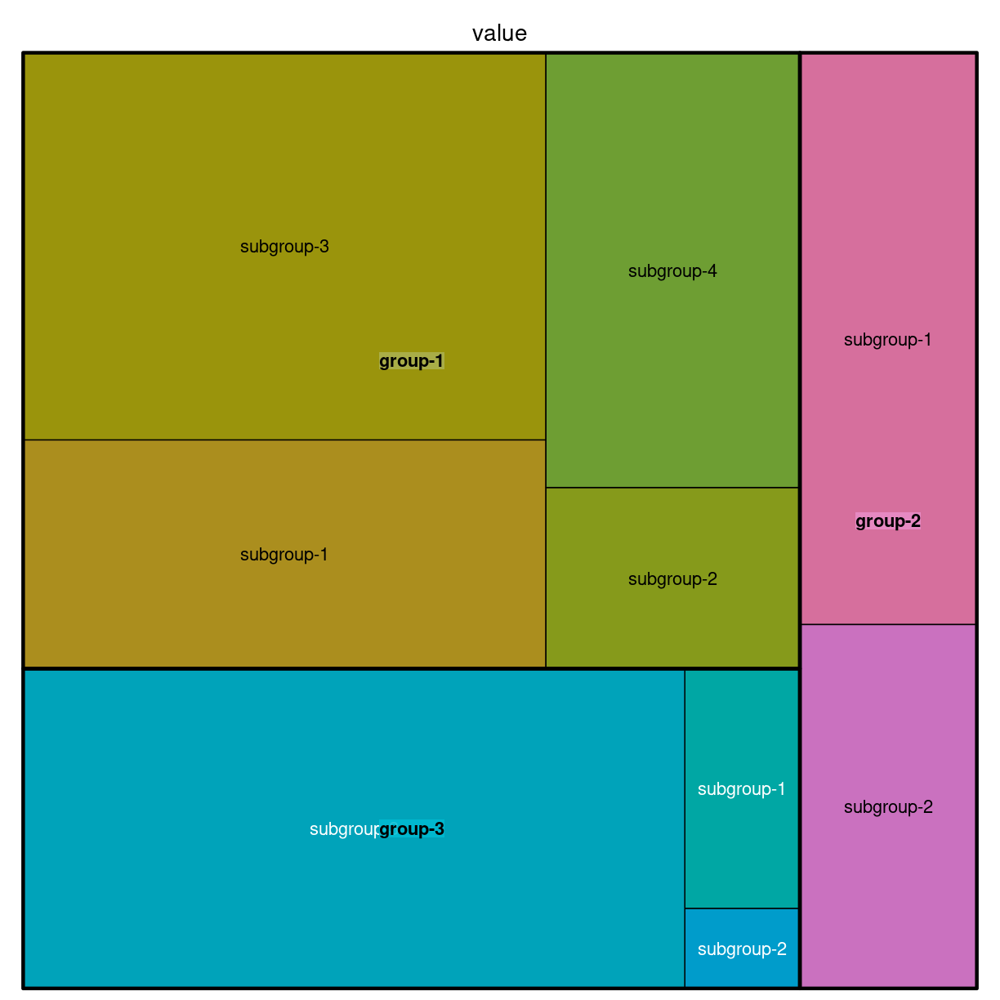

---
# Please do not edit this file directly; it is auto generated.
# Instead, please edit 05-parts.md in _episodes_rmd/
title: "Parts of a whole"
teaching: 42
exercises: 47
questions: 
- "FIXME"

objectives:
- "FIXME"

keypoints:
- "FIXME"
source: Rmd
---

## Barplot - grouped and stacked
### What are they?

plot of chunk barplot_what

### What do we use them for?

### how do we make them?

~~~
penguins %>% 
  filter(!is.na(sex)) %>% 
  ggplot(aes(species, fill=sex)) +
  geom_bar()
~~~
{: .language-r}

plot of chunk barplot_stacked_how

~~~
penguins %>% 
  filter(!is.na(sex)) %>% 
  ggplot(aes(species, fill=sex)) +
  geom_bar(position="dodge")
~~~
{: .language-r}

plot of chunk barplot_grouped_how

### Interesting variations

### Think about

## Treemap

### What are they?
Viser hierarkisk data i nestede rektangler. Hver gruppe repræsenteres af en
rektangel, hvis areal er proportionalt med dens værdi.

treemap.

Den kan også gøres interaktiv med detreeR.

### What do we use them for?

### how do we make them?

Vi bygger dem med pakken treemap.

Vi skal bruge noget data.
Det organiseres, i den enkleste udgave på denne måde:

~~~
data <- tribble(~group, ~value,
                "one", 13,
                "two", 5,
                "three", 22)
~~~
{: .language-r}

Og så laver vi det med:

~~~
library(treemap)
treemap(data,
        index = "group",
        vSize="value")
~~~
{: .language-r}

plot of chunk unnamed-chunk-3

Det kan også gøres med ggplot:

~~~
library(treemapify)
ggplot(data, aes(area = value, fill = group)) +
  geom_treemap()
~~~
{: .language-r}

plot of chunk unnamed-chunk-4

### Interesting variations

#### Hierarkisk
For det tilfælde at en (eller flere) grupper har underkategorier.

~~~
group <- c(rep("group-1",4),rep("group-2",2),rep("group-3",3))
subgroup <- paste("subgroup" , c(1,2,3,4,1,2,1,2,3), sep="-")
value <- c(13,5,22,12,11,7,3,1,23)
data <- data.frame(group,subgroup,value)
 
# treemap
treemap(data,
            index=c("group","subgroup"),
            vSize="value",
            type="index"
            ) 
~~~
{: .language-r}

plot of chunk unnamed-chunk-5

### Think about

## Doughnut

### What are they?
En lagkage med hul i. Og derfor ca. lige så ringe som lagkagediagrammer

### What do we use them for?
Mange ting - som man ikke bør bruge dem til.

### how do we make them?

fordi de er noget skrammel, understøtter ggplot2 dem ikke direkte.

~~~
penguins %>% 
  group_by(species) %>% 
  summarise(count = n()) %>% 
  ungroup() %>% 
  mutate(frac = count/sum(count)) %>% 
  mutate(ymax = cumsum(frac)) %>% 
  mutate(ymin = lag(ymax, default = 0)) %>% 
  ggplot(aes(ymax=ymax, ymin = ymin, xmax = 4, xmin = 3, fill=species)) +
  geom_rect() +
  coord_polar(theta="y") +
  xlim(c(2,4))
~~~
{: .language-r}

plot of chunk unnamed-chunk-6

~~~
# Create test data.
data <- data.frame(
  category=c("A", "B", "C"),
  count=c(10, 60, 30)
)
 
# Compute percentages
data$fraction = data$count / sum(data$count)

# Compute the cumulative percentages (top of each rectangle)
data$ymax = cumsum(data$fraction)

# Compute the bottom of each rectangle
data$ymin = c(0, head(data$ymax, n=-1))

ggplot(data, aes(ymax=ymax, ymin=ymin, xmax=4, xmin=3, fill=category)) +
     geom_rect() +
     coord_polar(theta="y") + # Try to remove that to understand how the chart is built initially
     xlim(c(2, 4)) # Try to remove that to see how to make a pie chart
~~~
{: .language-r}

plot of chunk unnamed-chunk-7

### Interesting variations

### Think about

## Pie chart

### What are they?

verdens værste plot type.

En cirkel delt ind i slices hvor hver repræsentere en andel af helet.

### What do we use them for?
Alt. det er en del af problemet...

### how do we make them?

~~~
penguins %>% 
  group_by(species) %>% 
  summarise(count = n()) %>% 
  ungroup() %>% 
  ggplot(aes(x="", y =count, fill = species)) +
  geom_bar(stat = "identity", width = 1) +
  coord_polar("y", start = 0)
~~~
{: .language-r}

plot of chunk unnamed-chunk-8

ggplot har holdninger. Så der er ikke et geom_ i ggplot til at lave 
lagkager.

Skal man - så laver man et barplot, og ændrer på koordinatsystemet med 
coord_polar. 

### Interesting variations

Der er ingen gode variationer. Lad nu bare være.

### Think about

Overvej helt at lade være med at lave den. Brug barcharts, treemaps eller andet.

### Hvorfor er det grafen fra helvede?

Problemet med piecharts er at de grundlæggende viser forskelle på forskellige
grupper ved at vise en vinkel. Og det er vi mennesker ret dårlige til.

lad os lave tre piecharts, og tre barcharts. 
https://www.data-to-viz.com/caveat/pie.html

~~~
library(tidyverse)
a <- data.frame( name=letters[1:5], value=c(17,18,20,22,24) )
b <- data.frame( name=letters[1:5], value=c(20,18,21,20,20)  )
c <- data.frame( name=letters[1:5], value=c(24,23,21,19,18) )

a <- a %>% 
  arrange(desc(name)) %>%
  mutate(prop = value / sum(a$value) *100) %>%
  mutate(ypos = cumsum(prop)- 0.5*prop )

b <- b %>% 
  arrange(desc(name)) %>%
  mutate(prop = value / sum(b$value) *100) %>%
  mutate(ypos = cumsum(prop)- 0.5*prop )

c <- c %>% 
  arrange(desc(name)) %>%
  mutate(prop = value / sum(c$value) *100) %>%
  mutate(ypos = cumsum(prop)- 0.5*prop )

# Basic piechart
pa <- ggplot(a, aes(x="", y=prop, fill=name)) +
  geom_bar(stat="identity", width=1, color="white") +
  coord_polar("y", start=0) +
  theme_void() + 
  theme(legend.position="none") +
  geom_text(aes(y = ypos, label = name), color = "white", size=6) +
  scale_fill_brewer(palette="Set2")
  
pb <- ggplot(b, aes(x="", y=prop, fill=name)) +
  geom_bar(stat="identity", width=1, color="white") +
  coord_polar("y", start=0) +
  theme_void() + 
  theme(legend.position="none") +
  geom_text(aes(y = ypos, label = name), color = "white", size=6) +
  scale_fill_brewer(palette="Set2")

pc <- ggplot(c, aes(x="", y=prop, fill=name)) +
  geom_bar(stat="identity", width=1, color="white") +
  coord_polar("y", start=0) +
  theme_void() + 
  theme(legend.position="none") +
  geom_text(aes(y = ypos, label = name), color = "white", size=6) +
  scale_fill_brewer(palette="Set2")

pa + pb + pc
~~~
{: .language-r}

plot of chunk unnamed-chunk-9

Hvad er udviklingen i det?

~~~
ba <- a %>% ggplot(aes(name, value, fill = name))  +
  geom_bar(stat= "identity") +
  scale_fill_brewer(palette="Set2") +
  theme(
    legend.position = "none",
    panel.grid = element_blank()
  ) +
  xlab("") +
  ylab("")
bb <- b %>% ggplot(aes(name, value, fill = name))  +
  geom_bar(stat= "identity") +
  scale_fill_brewer(palette="Set2") +
  theme(
    legend.position = "none",
    panel.grid = element_blank()
  ) +
  xlab("") +
  ylab("")
bc <- c %>% ggplot(aes(name, value, fill = name))  +
  geom_bar(stat= "identity") +
  scale_fill_brewer(palette="Set2") +
  theme(
    legend.position = "none",
    panel.grid = element_blank()
  ) +
  xlab("") +
  ylab("")
ba+bb+bc
~~~
{: .language-r}

plot of chunk unnamed-chunk-10

Kunne du se det da det var lagkagediagrammer? Nej, det kunne du ikke. 
Så lad nu bare være med at lave dem.

#### Pie charts can be made even worse

Please dont. 3D-effects. Exploding piecharts. Percentages that do not sum to
100. Too many slices. Almost anything added to piecharts will make them
even worse. 

It can be done in R. But it is difficult. ggplot2 have opinions, and makes it
difficult to commit crimes against datavisualisation.

In some, very rare, cases a pie chart will be the best chart for what we 
want to visualize. And in some, even more rare cases, a pie chart can be improved
to make it even better, by adding stuff to it.

But as a general rule: Dont.

## Dendrogram
https://cran.r-project.org/web/packages/ggdendro/vignettes/ggdendro.html
### What are they?

### What do we use them for?

### how do we make them?

~~~
library(ggraph)
library(igraph)
~~~
{: .language-r}

~~~

Attaching package: 'igraph'
~~~
{: .output}

~~~
The following objects are masked from 'package:lubridate':

    %--%, union
~~~
{: .output}

~~~
The following objects are masked from 'package:dplyr':

    as_data_frame, groups, union
~~~
{: .output}

~~~
The following objects are masked from 'package:purrr':

    compose, simplify
~~~
{: .output}

~~~
The following object is masked from 'package:tidyr':

    crossing
~~~
{: .output}

~~~
The following object is masked from 'package:tibble':

    as_data_frame
~~~
{: .output}

~~~
The following objects are masked from 'package:stats':

    decompose, spectrum
~~~
{: .output}

~~~
The following object is masked from 'package:base':

    union
~~~
{: .output}

~~~
library(tidyverse)
 
# create an edge list data frame giving the hierarchical structure of your individuals
d1 <- data.frame(from="origin", to=paste("group", seq(1,5), sep=""))
d2 <- data.frame(from=rep(d1$to, each=5), to=paste("subgroup", seq(1,25), sep="_"))
edges <- rbind(d1, d2)
 
# Create a graph object 
mygraph <- graph_from_data_frame( edges )
 
# Basic tree
ggraph(mygraph, layout = 'dendrogram', circular = FALSE) + 
  geom_edge_diagonal() +
  geom_node_point() +
  theme_void()
~~~
{: .language-r}

~~~
Warning: Using the `size` aesthetic in this geom was deprecated in ggplot2 3.4.0.
ℹ Please use `linewidth` in the `default_aes` field and elsewhere instead.
This warning is displayed once every 8 hours.
Call `lifecycle::last_lifecycle_warnings()` to see where this warning was
generated.
~~~
{: .warning}

plot of chunk unnamed-chunk-11

Men også ggdendro! Den baserer sig på resultater fra hclust

### Interesting variations

### Think about

## Circular packing

### What are they?

### What do we use them for?
Kan vise hierarkisk organisering. Ækvivalent til treemap og dendrogrammer.
Hver node repræsenteres af en cirkel. Hver subnode repræsenteres som en cirkel
inden i denne cirkel.

Enkelt niveua laves med ggiraph og/eller packcirles.

Flere niveauer laves med ggraph

Der kan laves interaktive ting med flere niveauer med circlepackeR.

### how do we make them?

### Interesting variations

### Think about


