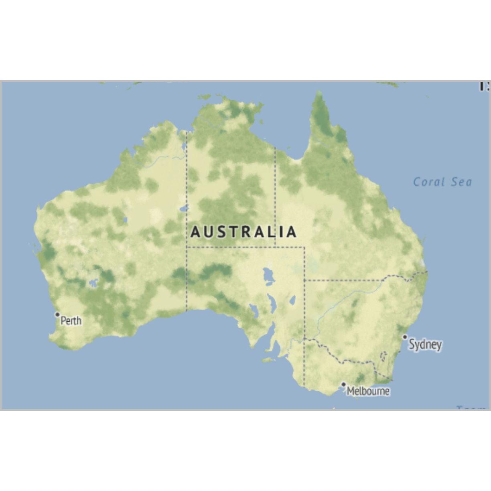

---
# Please do not edit this file directly; it is auto generated.
# Instead, please edit 07-maps.md in _episodes_rmd/
title: "Maps"
teaching: 42
exercises: 47
questions: 
- "FIXME"

objectives:
- "FIXME"

keypoints:
- "FIXME"
source: Rmd
---

## Map
### What are they?

Det skal vi helst ikke forklare. Og de er i øvrig mest interessante i kombination
med data.

### What do we use them for?

### how do we make them?

Det er ikke helt optimalt. Men det lader til at man kan få stamen til at 
fungere...

~~~
library(ggmap)
~~~
{: .language-r}

~~~
Loading required package: ggplot2
~~~
{: .output}

~~~
ℹ Google's Terms of Service: <https://mapsplatform.google.com>
~~~
{: .output}

~~~
ℹ Please cite ggmap if you use it! Use `citation("ggmap")` for details.
~~~
{: .output}

~~~
library(tidyverse)
~~~
{: .language-r}

~~~
── Attaching packages
───────────────────────────────────────
tidyverse 1.3.2 ──
~~~
{: .output}

~~~
✔ tibble  3.1.8      ✔ dplyr   1.0.10
✔ tidyr   1.2.1      ✔ stringr 1.5.0 
✔ readr   2.1.3      ✔ forcats 0.5.2 
✔ purrr   0.3.5      
── Conflicts ────────────────────────────────────────── tidyverse_conflicts() ──
✖ dplyr::filter() masks stats::filter()
✖ dplyr::lag()    masks stats::lag()
~~~
{: .output}

~~~
map <- get_stamenmap( bbox = c(left = 110, bottom = -40, right = 160, top = -10), zoom = 4, maptype = "terrain")
~~~
{: .language-r}

~~~
ℹ Map tiles by Stamen Design, under CC BY 3.0. Data by OpenStreetMap, under ODbL.
~~~
{: .output}

~~~
ggmap(map) + 
  theme_void() + 
  theme(
    plot.title = element_text(colour = "orange"), 
    panel.border = element_rect(colour = "grey", fill=NA, size=2)
  )
~~~
{: .language-r}

~~~
Warning: The `size` argument of `element_rect()` is deprecated as of ggplot2 3.4.0.
ℹ Please use the `linewidth` argument instead.
~~~
{: .warning}

### Interesting variations

### Think about

## Choropleth
### What are they?

Et kort som vi deler op i geografiske enheder. Og så farvelægger vi dem
efter en eller anden variabel. 

leaflet hvis interaktivt, ggplot2/ggmap for statiske kortl

### What do we use them for?

### how do we make them?

Kort generelt falder i to dele. Find data at indlæse. shapefiles eller 
geoJSON. Nogle pakker har data med der er egnet. Man kan også hente
ting fra google og openstreetmap.

Manipuler data og plot det.

leaflet til interaktive kort.

HUSK - DER SKAL NOGET JAVE HEJS IND OVER FOR AT LAVE DEM!

ggmap til statiske kort.

Nyttige pakker med kortdata: maps, mapdata og oz

### Interesting variations

### Think about

## Hexbin map
Her skal vi have fundet noget geografisk data på Frankrig! 

### What are they?

Kort, hvor vi splitter regionen/kloden/whatever vi plotter, op i hexagoner 
(sekskanter). Enten selve arealet, altså at hver kommune i danmark optræder
som en hexagon. Eller hvor vi deler danmark op i hexagoner, og så plotter
vi 2D densities på det kort. 

### What do we use them for?

### how do we make them?

### Interesting variations

### Think about

## Cartogram

### What are they?

Kort hvor vi forvrænger regioners (landes, kommuners, delstaters etc.) form
for at vise en egenskab. 

Her bruger vi pakken `cartogram`

Den kan animeres. Og laves på hexbin kort

### What do we use them for?

### how do we make them?

### Interesting variations

### Think about

## Connection

### What are they?

### What do we use them for?

### how do we make them?

### Interesting variations

### Think about

## Bubble map

### What are they?

### What do we use them for?

### how do we make them?

### Interesting variations

### Think about


