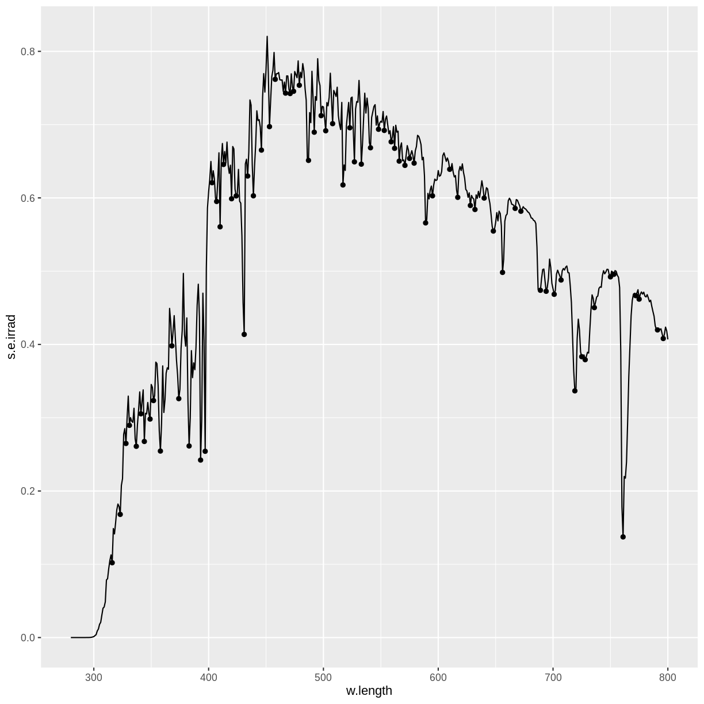

---
# Please do not edit this file directly; it is auto generated.
# Instead, please edit 09-specialty.md in _episodes_rmd/
title: "Specialty plots"
teaching: 0
exercises: 0
questions: 
- "ROC"

objectives:
- "FIXME"

keypoints:
- "FIXME"
source: Rmd
---

Special ting, vi prøver at holde det til ting der ikke er dækket af de 
øvrige; til plots der bruges i ganske særlige sammenhænge.

Kig på ggsurvfit pakken

## spectra
Primært er det vist de stat_ functioner der følger med der er interessante.

~~~
install.packages("ggspectra")
~~~
{: .language-r}

~~~
Installing package into '/home/runner/work/_temp/Library'
(as 'lib' is unspecified)
~~~
{: .output}

~~~
library(ggspectra)
~~~
{: .language-r}

~~~
Loading required package: photobiology
~~~
{: .output}

~~~
News at https://www.r4photobiology.info/
~~~
{: .output}

~~~
Loading required package: ggplot2
~~~
{: .output}

~~~
ggplot(sun.spct)  +
  geom_line() +
  ggspectra::stat_valleys()
~~~
{: .language-r}

## ROC curves

Når vi laver logistiske regressioner, forsøger vi at fitte en model til 
en virkelighed hvor vores responsvariabel er binær. Ja/nej, sand/falsk.

I analysen af hvordan radaroperatører under anden verdenskrig klarede sig, opfandt 
man denne metode. Vi ser noget på en skærm. Vi ser mange forskellige input på 
en skærm. Vurder om det er en tysk bombemaskine på vej mod London, eller en
flok gæs.

Der er to interessante ting. Sensitiviteten. Sandsynligheden for at vi beslutter
os for at det er tyskere, når det faktisk er tyskere.

Specificiteten, Sandsynligheden for at vi beslutter os for at det er gæs, når det 
faktisk er gæs.

Der er subtile forskelle mellem de to.

Den ideelle model har en sensitivitet på 1. Og en specificitet på 1.

Vi skal starte med at have noget data, før vi kan plotte en roc-kurve. Hvis ikke
du har det data, så kom igen når du har det.

AUC, ROC, 

survival, den slags.
## Survival plots

## manhattan plots

## scree plots

## biplots - pca


