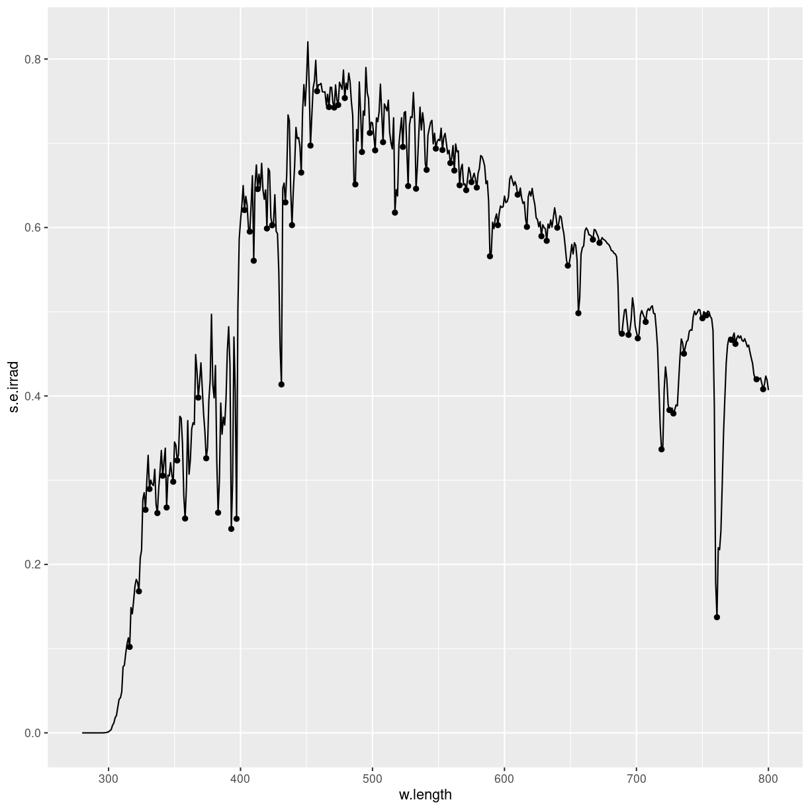

---
# Please do not edit this file directly; it is auto generated.
# Instead, please edit 09-specialty.md in _episodes_rmd/
title: "Specialty plots"
teaching: 0
exercises: 0
questions: 
- "ROC"

objectives:
- "FIXME"

keypoints:
- "FIXME"
source: Rmd
---

Special ting, vi prøver at holde det til ting der ikke er dækket af de 
øvrige; til plots der bruges i ganske særlige sammenhænge.

Kig på ggsurvfit pakken

## spectra
### What are they?
### What do we use them for?
### how do we make them?
### Interesting variations
### Think about

Primært er det vist de stat_ functioner der følger med der er interessante.

~~~
install.packages("ggspectra")
~~~
{: .language-r}

~~~
Installing package into '/home/runner/work/_temp/Library'
(as 'lib' is unspecified)
~~~
{: .output}

~~~
library(ggspectra)
~~~
{: .language-r}

~~~
Loading required package: photobiology
~~~
{: .output}

~~~
News at https://www.r4photobiology.info/
~~~
{: .output}

~~~
Loading required package: ggplot2
~~~
{: .output}

~~~
ggplot(sun.spct)  +
  geom_line() +
  ggspectra::stat_valleys()
~~~
{: .language-r}

## ROC curves
### What are they?
### What do we use them for?
### how do we make them?
### Interesting variations
### Think about

Men hvordan hænger de data sammen med det plot?

Vi har en kontinuert værdi. Den bruger vi til at forudsige et binært outcome.

Oprindelsen har rødder til radar-operatører i England under anden verdenskrig.
Der var input fra radarene. Baseret på dem forsøgte man at skelne. Var det 
tyske bombefly? Eller var det ikke? I sidste tilfælde var det ofte gæs.

Der er to mulige fejl. Enten siger man tyskere når det var gæs. Eller også
siger man gæs når det var tyskere. Den ene er falsk positiv. Den anden er 
falsk negativ. Fortegnet er styret af hvad man prøver at opdage.

Nogle radar-operatører var bedre 
end andre. ROC-kurven giver os et værktøj til at sætte tal på forskellen.

Vi bruger pakken plotROC. eller - det gør vi måske ikke. Jo, det gør vi!

Vi skal have noget data:

~~~
set.seed(47)
D.ex <- rbinom(200, size = 1, prob = .5)
M1 <- rnorm(200, mean = D.ex, sd = .65)
#M2 <- rnorm(200, mean = D.ex, sd = 1.5)

test <- data.frame(D = D.ex, D.str = c("Gås", "Tysker")[D.ex + 1], 
                   M1 = M1, stringsAsFactors = FALSE)

head(test)
~~~
{: .language-r}

~~~
  D  D.str         M1
1 1 Tysker  0.9073656
2 0    Gås -0.3025575
3 1 Tysker  0.7239910
4 1 Tysker  1.4857584
5 1 Tysker  1.4286289
6 1 Tysker  1.1292391
~~~
{: .output}

hvad er det vi har?

~~~
library(plotROC)
test %>% ggplot(aes(d = D, m = M1)) +
  geom_roc()
~~~
{: .language-r}

~~~
Error in test %>% ggplot(aes(d = D, m = M1)): could not find function "%>%"
~~~
{: .error}

Når vi laver logistiske regressioner, forsøger vi at fitte en model til 
en virkelighed hvor vores responsvariabel er binær. Ja/nej, sand/falsk.

I analysen af hvordan radaroperatører under anden verdenskrig klarede sig, opfandt 
man denne metode. Vi ser noget på en skærm. Vi ser mange forskellige input på 
en skærm. Vurder om det er en tysk bombemaskine på vej mod London, eller en
flok gæs.

Der er to interessante ting. Sensitiviteten. Sandsynligheden for at vi beslutter
os for at det er tyskere, når det faktisk er tyskere.

Specificiteten, Sandsynligheden for at vi beslutter os for at det er gæs, når det 
faktisk er gæs.

Der er subtile forskelle mellem de to.

Den ideelle model har en sensitivitet på 1. Og en specificitet på 1.

Vi skal starte med at have noget data, før vi kan plotte en roc-kurve. Hvis ikke
du har det data, så kom igen når du har det.

AUC, ROC, 

survival, den slags.
## Survival plots
### What are they?
### What do we use them for?
### how do we make them?
### Interesting variations
### Think about

## manhattan plots
### What are they?
### What do we use them for?
### how do we make them?
### Interesting variations
### Think about

## scree plots
### What are they?
### What do we use them for?
### how do we make them?
### Interesting variations
### Think about

## biplots - pca
### What are they?
### What do we use them for?
### how do we make them?
### Interesting variations
### Think about


