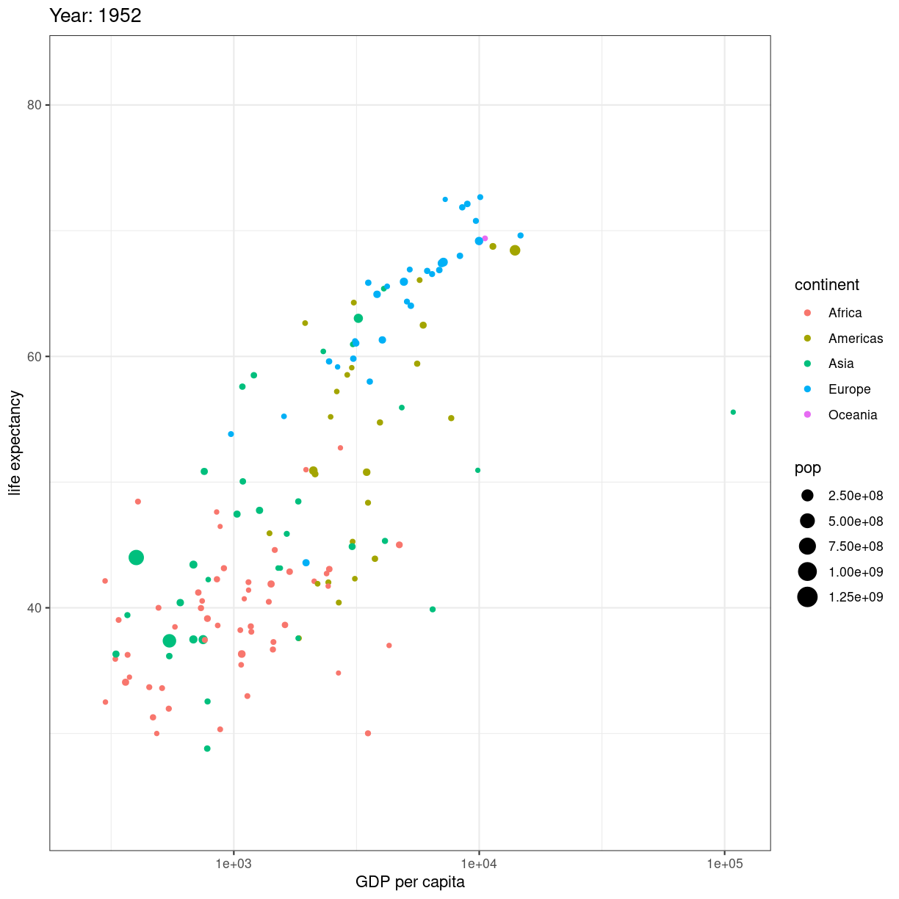

---
# Please do not edit this file directly; it is auto generated.
# Instead, please edit 10-animation.md in _episodes_rmd/
title: "Animations"
teaching: 42
exercises: 47
questions: 
- "FIXME"

objectives:
- "FIXME"

keypoints:
- "FIXME"
source: Rmd
---

animerede plots. Det er jeg ikke sikker på kan håndteres her - men lad os se:

Det kan de...

En fiks måde at vise en udvikling er ved at animere plottet. Start med at lave
dit plot, og facetter efter tidsvariablen:

~~~
ggplot(gapminder, aes(gdpPercap, lifeExp, size = pop, color = continent)) +
  geom_point() +
  facet_wrap(~year)
~~~
{: .language-r}

plot of chunk unnamed-chunk-1

Når så du vil animere, erstatter du `facet_wrap(~year)`  med `transition_time(year)`.
og vupti har du en animation. I dette tilfælde smider vi ldit ekstra på.

~~~
# Make a ggplot, but add frame=year: one image per year
ggplot(gapminder, aes(gdpPercap, lifeExp, size = pop, color = continent)) +
  geom_point() +
  scale_x_log10() +
  theme_bw() +
  # gganimate specific bits:
  labs(title = 'Year: {frame_time}', x = 'GDP per capita', y = 'life expectancy') +
  transition_time(year) +
  ease_aes('linear')
~~~
{: .language-r}

plot of chunk animation_test

Vi smider en logaritmisk skala på x-aksen, piller i hvordan plottet themes. 
Og så skriver vi eksplicit `ease_aes('linear')`. For hvad stiller vi op når 
vi har et punkt til tiden 1957, og et til tiden 1962, men ikke til årene imellem?

Vi lader R beregne hvordan punktet ville se ud i 1958, 1959 etc. Hvis ændringen er
lineær. Der er andre muligheder end lineær. Læs dokumentationen for mulighederne.

Hvad hvis vi deler den op?

~~~
# Save at gif:
anim_save("../fig/271-ggplot2-animated-gif-chart-with-gganimate1.gif")
~~~
{: .language-r}


