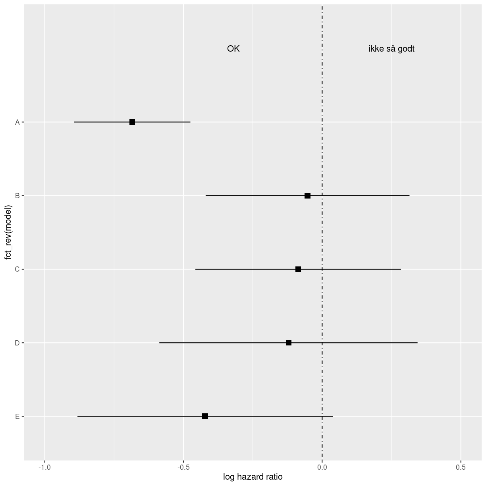
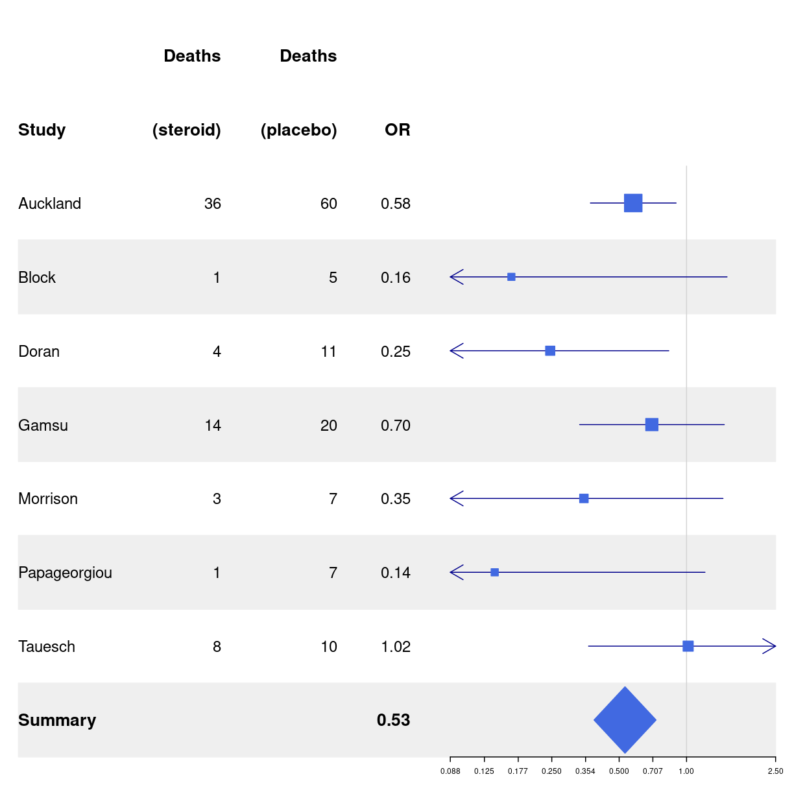

---
# Please do not edit this file directly; it is auto generated.
# Instead, please edit 40-forrestplots-annotated.md in _episodes_rmd/
title: "Forest plots"
teaching: 0
exercises: 0
questions: 
- "FIXME"

objectives:
- "FIXME"

keypoints:
- "FIXME"
source: Rmd
---

## hvad er de?
Forest plots (der ikke har noget med skove at gøre) er 
plots der viser de estimerede resultater fra flere videnskabelige studier -
af samme fænomen. Sammen med de samlede resultater. De bruges i metaanalyser
af litteraturen. Og kaldes også blobbogrammer.

## Hvordan laver man dem?

Man starter med at lade den rigtige funktion beregne odds ratioer for ens
studier. 

annoteret

vi vil godt have p-værdier på dem. 
så vi starter med at få trukket data ud på de forskellige modeller. Her er noget
data vi har forberedt på forhånd. Der er fem modeller, der er estimater, lav og høj 
ende af konfidensintervallerne, p-værdier. Og (den naturlige) logaritme af 
estimat og konfidensintervaller:

~~~
data <- tribble(
~model, ~log.estimate, ~log.conf.low, ~log.conf.high, ~estimate, ~conf.low, ~conf.high, ~p.value,
"A",          -0.685,        -0.895   ,   -0.475  ,    0.504  ,  0.409  ,   0.622, 1.68e-10,
"B",          -0.0526,       -0.420   ,    0.315   ,   0.949  ,  0.657  ,   1.37,  7.79e-1,
"C",          -0.0864 ,      -0.457   ,    0.284   ,   0.917  ,  0.633  ,   1.33,  6.47e-1,
"D",          -0.121   ,     -0.587  ,     0.344  ,    0.886  ,  0.556  ,   1.41,  6.09e-1,
"E",          -0.422    ,    -0.882 ,      0.0386 ,    0.656  ,  0.414  ,   1.04,  7.26e-2 
)

forestplot(base_data)
~~~
{: .language-r}

~~~
Error in eval(expr, envir, enclos): object 'base_data' not found
~~~
{: .error}

Det skal vi have plottet:

~~~
midt <- data %>% 
  ggplot(aes(y = fct_rev(model))) +
  # theme_classic() +
  geom_point(aes(x =log.estimate), shape = 15, size = 3) +
  geom_linerange(aes(xmin = log.conf.low, xmax = log.conf.high)) +
  labs(x = "log hazard ratio") +
  coord_cartesian(ylim=c(1,6), xlim=c(-1,.5)) +
  geom_vline(xintercept = 0, linetype = "dotdash") +
  annotate("text", x = -.32, y = 6, label = "OK") +
  annotate("text", x = 0.25, y = 6, label = "ikke så godt")
midt
~~~
{: .language-r}

plot of chunk unnamed-chunk-3

Det er det plot vi vil have i midten, så det gemmer vi.

Så har vi noget vi vil se til venstre for det plot:

~~~
# Cochrane data from the 'rmeta'-package
base_data <- tibble::tibble(mean  = c(0.578, 0.165, 0.246, 0.700, 0.348, 0.139, 1.017),
                            lower = c(0.372, 0.018, 0.072, 0.333, 0.083, 0.016, 0.365),
                            upper = c(0.898, 1.517, 0.833, 1.474, 1.455, 1.209, 2.831),
                            study = c("Auckland", "Block", "Doran", "Gamsu",
                                      "Morrison", "Papageorgiou", "Tauesch"),
                            deaths_steroid = c("36", "1", "4", "14", "3", "1", "8"),
                            deaths_placebo = c("60", "5", "11", "20", "7", "7", "10"),
                            OR = c("0.58", "0.16", "0.25", "0.70", "0.35", "0.14", "1.02"))

log(36/60)
~~~
{: .language-r}

~~~
[1] -0.5108256
~~~
{: .output}

~~~
base_data %>% 
  forestplot(labeltext = c(study, deaths_steroid, deaths_placebo, OR),
             clip = c(0.1, 2.5),
             xlog = TRUE) |>
  fp_set_style(box = "royalblue",
               line = "darkblue",
               summary = "royalblue") %>% 
  fp_add_header(study = c("", "Study"),
                deaths_steroid = c("Deaths", "(steroid)"),
                deaths_placebo = c("Deaths", "(placebo)"),
                OR = c("", "OR")) |>
  fp_append_row(mean  = 0.531,
                lower = 0.386,
                upper = 0.731,
                study = "Summary",
                OR = "0.53",
                is.summary = TRUE) %>% 
  fp_set_zebra_style("#EFEFEF")
~~~
{: .language-r}

plot of chunk unnamed-chunk-5


