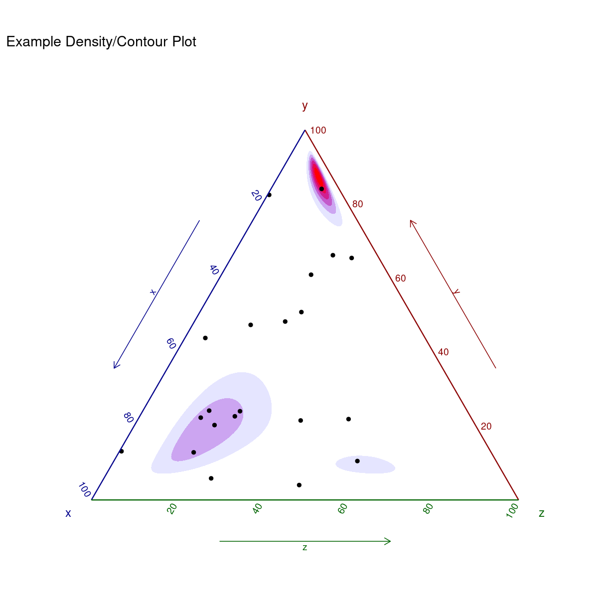

---
# Please do not edit this file directly; it is auto generated.
# Instead, please edit 50-ternary-plots.md in _episodes_rmd/
title: "Ternære plots"
teaching: 0
exercises: 0
questions: 
- "FIXME"

objectives:
- "FIXME"

keypoints:
- "FIXME"
source: Rmd
---

Sådden nogen her:

Hvis du ved at du har brug for at lave sådan et - så ved du også
hvordan du skal aflæse dem. Men vi har lige et eksempel eller to
til sidst alligevel.

Vi skal bruge en ekstra pakke, `ggtern`.

~~~
library(ggtern)
~~~
{: .language-r}

~~~
Registered S3 methods overwritten by 'ggtern':
  method           from   
  grid.draw.ggplot ggplot2
  plot.ggplot      ggplot2
  print.ggplot     ggplot2
~~~
{: .output}

~~~
--
Remember to cite, run citation(package = 'ggtern') for further info.
--
~~~
{: .output}

~~~

Attaching package: 'ggtern'
~~~
{: .output}

~~~
The following objects are masked from 'package:ggplot2':

    aes, annotate, ggplot, ggplot_build, ggplot_gtable, ggplotGrob,
    ggsave, layer_data, theme_bw, theme_classic, theme_dark,
    theme_gray, theme_light, theme_linedraw, theme_minimal, theme_void
~~~
{: .output}
Så skal vi bruge noget data der kan plottes på den måde. De kommer
oprindeligt herfra:
https://ourworldindata.org/electricity-mix

Dem indlæser vi:

~~~
elmix <- read_csv("../data/electricity-prod-source.csv")
~~~
{: .language-r}

~~~
Rows: 8070 Columns: 15
── Column specification ────────────────────────────────────────────────────────
Delimiter: ","
chr  (2): land, code
dbl (13): aar, Coal, Gas, Hydro, Nuclear, Oil, Other_renewables, Solar, Wind...

ℹ Use `spec()` to retrieve the full column specification for this data.
ℹ Specify the column types or set `show_col_types = FALSE` to quiet this message.
~~~
{: .output}

Du kan finde dem her: (indsæt link når siden er renderet første gang).

Vi kan lave dem på to måder. Enten direkte:

~~~
elmix %>% 
  filter(aar == 2018, land == "Sweden") %>% 
  ggtern(aes(x=fossil/total, 
             y = vedvarende/total, 
             z = kernekraft/total)) +
  geom_point()
~~~
{: .language-r}

plot of chunk unnamed-chunk-4

den ser ud som den gør, fordi fordelingen af elproduktionen i 
Sverige i 2018 var således:

~~~
elmix %>% 
  filter(aar == 2018, land == "Sweden") %>% 
  transmute(fossil = fossil/total,
         vedvarende = vedvarende/total,
         kernekraft = kernekraft/total) %>% 
  pivot_longer(everything(), names_to = "kilde",
               values_to = "andel") %>% 
  mutate(andel = scales::percent(andel)) %>% 
  knitr::kable()
~~~
{: .language-r}

|kilde      |andel |
|:----------|:-----|
|fossil     |2%    |
|vedvarende |56%   |
|kernekraft |42%   |
I stedet kan vi bruge ggplot (ggtern er baseret på den), og supplere
med et nyt koordinatsystem:

~~~
tern_plot <- elmix %>% 
  filter(aar == 2018, land == "Sweden") %>% 
  ggplot(aes(x=fossil, 
             y = vedvarende, 
             z = kernekraft)) +
  coord_tern() +
  geom_point()
~~~
{: .language-r}

~~~
Coordinate system already present. Adding new coordinate system, which will
replace the existing one.
~~~
{: .output}

~~~
tern_plot
~~~
{: .language-r}

plot of chunk unnamed-chunk-6

Bemærk også at det ikke var nødvendigt at beregne andelene - det klarer
ggtern for os. Det var heller ikke nødvendigt i det første eksempel.

Vi kan bruge andre (men ikke alle) geoms fra ggplot. geom_text til
at sætte etiketter på eksempelvis. Vi får advarsler i konsollen hvis 
vi prøver at gøre noget der ikke er muligt.

ggtern kommer med egne ekstra geoms.

~~~
tern_plot + geom_crosshair_tern()
~~~
{: .language-r}

plot of chunk unnamed-chunk-7

Der kan gøre det lettere at aflæse punkterne. Det er stadig
pænt svært at huske hvad der er hvad. ggtern har nogen themes, der 
kan gøre det lettere:

~~~
tern_plot +
  geom_crosshair_tern() +
  theme_hidetitles() +
  theme_showarrows() 
~~~
{: .language-r}

plot of chunk unnamed-chunk-8

Der er *mange* andre ting gemt i pakken. Læs evt. dokumentationen.

Stier kan bruges til at illustrere hvordan tingene har udviklet sig. Her 
skal vi huske at der kan optræde NA værdier i datasættet. Dem kan vi 
ikke plotte. 
vi bruger geom_path som geom - og smider en pil på, så vi kan se
hvilken vej Frankrig bevæger sig.

~~~
elmix %>% 
  filter(land == "France") %>% 
  filter(complete.cases(.)) %>%
   ggplot(aes(x=fossil, 
             y = vedvarende, 
             z = kernekraft)) +
  geom_path(arrow = arrow(length=unit(.2, "cm"))) +
  coord_tern() +
  theme_hidetitles() +
  theme_showarrows()
~~~
{: .language-r}

~~~
Coordinate system already present. Adding new coordinate system, which will
replace the existing one.
~~~
{: .output}

plot of chunk unnamed-chunk-9

Blot som et eksempel på hvad man kan få ud hvis man bruger et 
par timer på hjælpefilerne:

~~~
ggtern(data = data.frame(x = rnorm(100),
                         y = rnorm(100),
                         z = rnorm(100)),
       aes(x, y, z)) +
  stat_density_tern(geom = 'polygon',
                    n    = 200,
                    aes(fill  = ..level..,
                        alpha = ..level..),
                    bdl = 0.02) +
  geom_point() +
  theme_rgbw() +
  labs(title = "Example Density/Contour Plot")    +
  scale_fill_gradient(low = "blue",high = "red")  +
  guides(color = "none", fill = "none", alpha = "none")
~~~
{: .language-r}

~~~
Warning: The dot-dot notation (`..level..`) was deprecated in ggplot2 3.4.0.
ℹ Please use `after_stat(level)` instead.
ℹ The deprecated feature was likely used in the ggplot2 package.
  Please report the issue at <https://github.com/tidyverse/ggplot2/issues>.
This warning is displayed once every 8 hours.
Call `lifecycle::last_lifecycle_warnings()` to see where this warning was
generated.
~~~
{: .warning}

~~~
Warning: Removed 86 rows containing non-finite values (`StatDensityTern()`).
~~~
{: .warning}

plot of chunk unnamed-chunk-10


